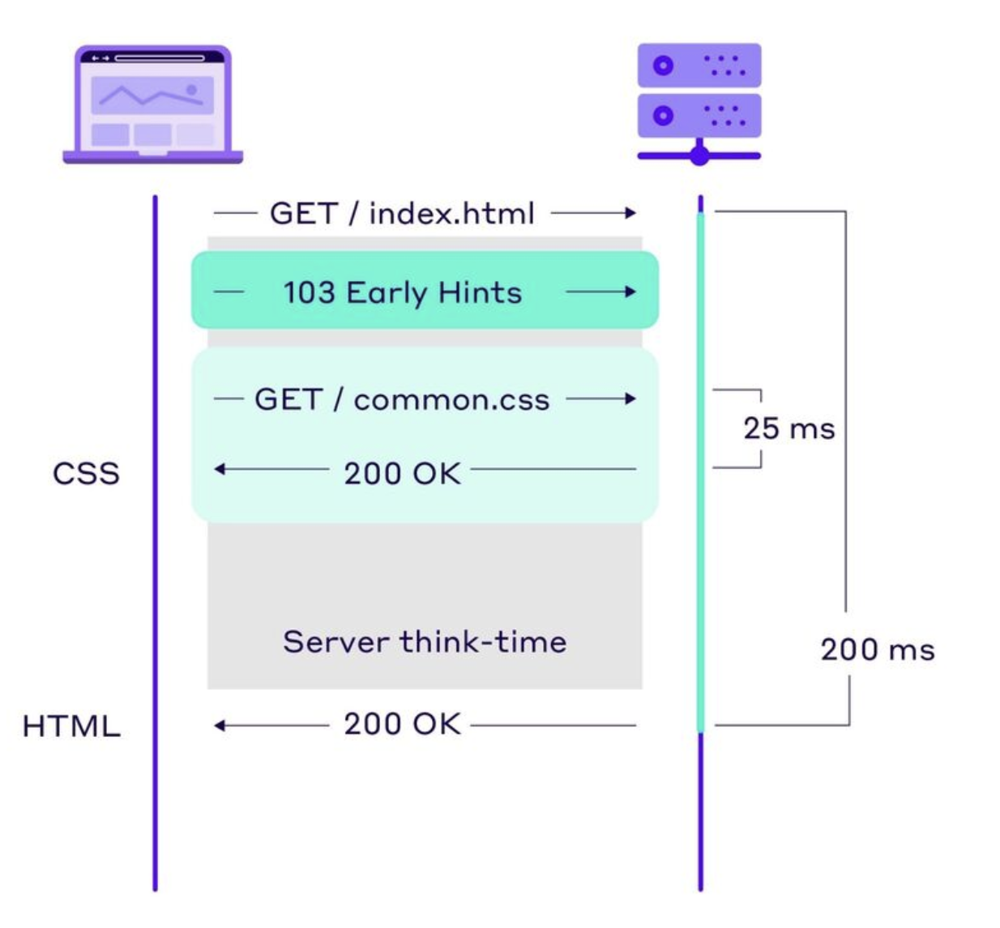

#  HTTP 103 Early Hints

A modern way to make web pages load faster.
FrankenPHP support this feature both in classic and worker mode.

### The issue
Browsers normally wait for the final response (200 OK) before discovering resources in the final HTML.
This delays downloading CSS, JS, fonts, images.
The result is slower than necessary "First Paint" and "Largest Contentful Paint".

### A solution
Send a 103 Early Hints response.
This is a "heads-up" from the server to the browser giving it hints about resources used by the final response.
The browser can start downloading the resources before the final response is received.

### How it works
1. Client requests a page.
2. Server quickly replies with 103 Early Hints:
    - Includes Link: headers for CSS/JS/fonts.
4. Browser starts fetching these resources immediately.
5. Server finishes preparing → sends 200 OK with content.



### Example Headers
```shell
HTTP/1.1 103 Early Hints
Link: </style.css>; rel=preload; as=style
Link: </app.js>; rel=preload; as=script

HTTP/1.1 200 OK
Content-Type: text/html
...
```

### Live Example

From the repository root run:
```shell
docker compose -f docker-compose-standalone.yml up
```

Open https://localhost/ in your browser, open the network tab in the developer tools and refresh the page.

**Note:** Browsers utilize local cache for 103 Early Hints so you need to ensure "disable caching" is NOT enabled in your browser!

### Resources

- https://developer.mozilla.org/en-US/docs/Web/HTTP/Status/103
- https://developer.chrome.com/docs/web-platform/early-hints
