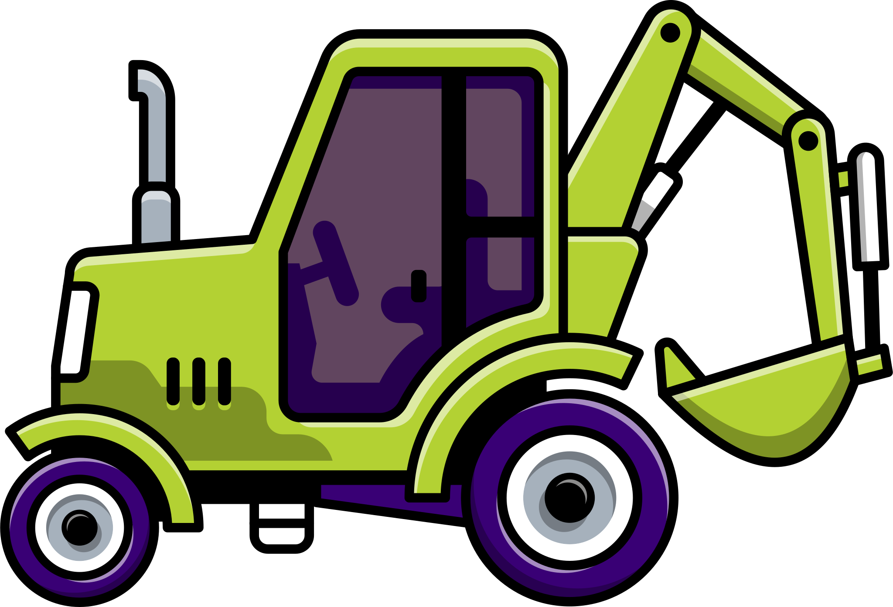
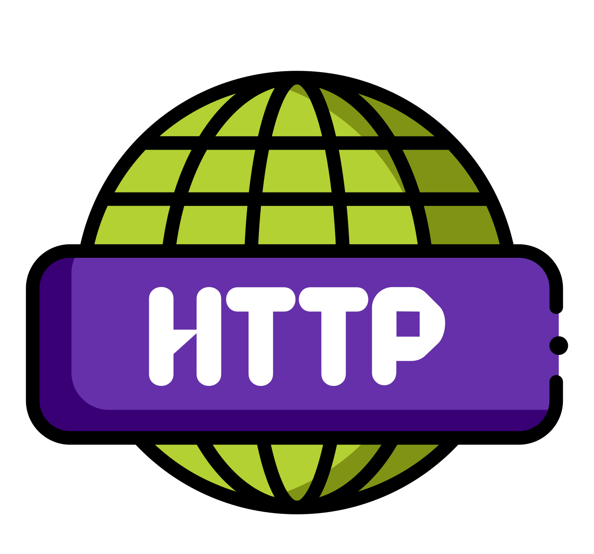

# Highlighted Features

##  Easy deploy
* Only one service, only one binary. No need for i.e a webserver + php-fpm.
* Config API to configure your application.

##  Extensible
PHP 8.2+ and most PHP extensions are natively supported

##  Worker mode
Boot your application once and keep it in memory. FrankenPHP will handle incoming requests in a few milliseconds.

##  103 Early Hints
A modern way to make web pages load faster, less memory.

##  HTTP/2 & HTTP/3
Native support for HTTP 1.1/2/3
* [Can I use HTTP/3](https://caniuse.com/http3)

##  First class HTTPS support
Automatic HTTPS certificates generation and renewal (Let's Encrypt or ZeroSSL)

##  Prometheus metrics and traces
Caddy exposes an HTTP endpoint that responds in the Prometheus exposition format. (OpenMetrics also available if negotiated)

##  Self-executable PHP apps as standalone binaries 
FrankenPHP has the ability to embed the source code and assets of PHP applications in a static, self-contained binary.

##  Performance
Out of the box, FrankenPHP try to offer a good compromise between performance and ease of use - if needed it is possible to tweak the configuration to significantly improve on performance.

---
