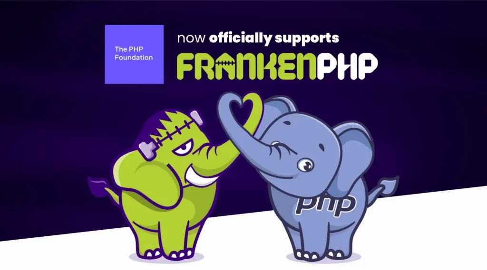

# Why

FrankenPHP is a modern app server for PHP written in Go, built on top of Caddy and bundling a PHP runtime. It is an alternative Server API
(SAPI) for PHP that is built on the Caddy web server, and includes a number of high-performance configuration options. No needs to install PHP separately.

## FrankenPHP moving under the PHP GitHub organization

The PHP Foundation has [decided to directly support the FrankenPHP project](https://thephp.foundation/blog/2025/05/15/frankenphp/) moving forward.

* Make it easier for PHP core contributors and others to be actively involved in the project.
* Portion of its documentation will also move to php.net.
* Essentially put the project in the same administrative "bucket" as PECL extensions.
* Its governance will not change.

## Drop in replacement for PHP-FPM

Operating in classic mode, FrankenPHP can be a drop-in replacement for PHP-FPM that combines a web server (Caddy) and PHP runtime into one, with the option to run PHP in a persistent, event-driven way.
In worker mode, Boot your application once and keep it in memory. FrankenPHP will handle incoming requests in a few milliseconds.

In either mode, FrankenPHP reduces complexity and overhead previously experienced with running a webserver, FastCGI and php-fpm by providing a single binary that can be deployed anywhere.

---
