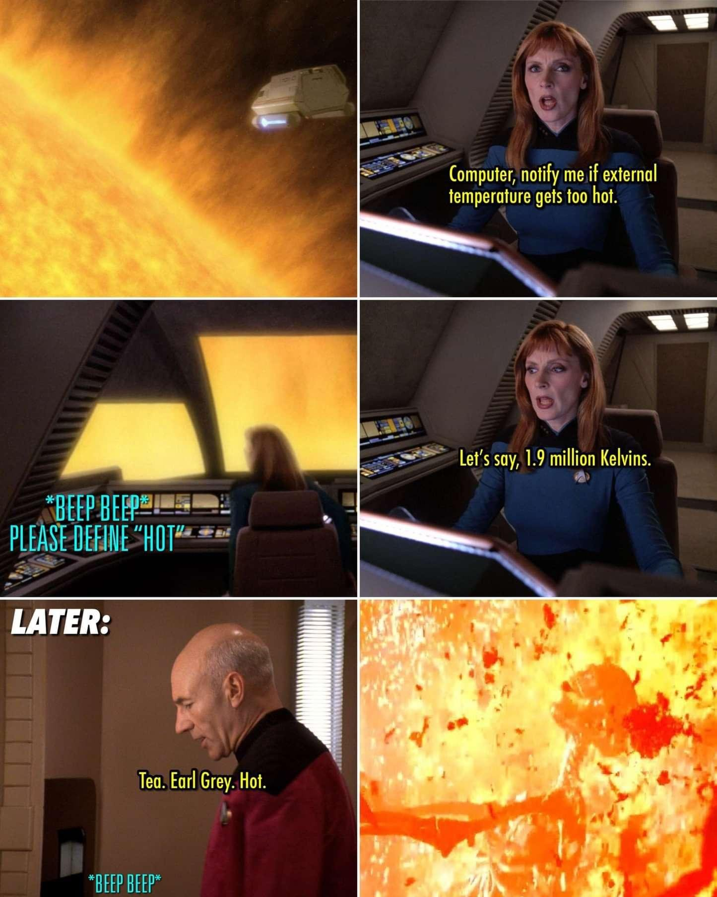

# FrankenPHP Worker Mode

* A single boostrap for repeating and expensive tasks.
* Out the box support for framework as [Laravel Octane](https://laravel.com/docs/12.x/octane), [Symfony](https://symfony.com/) and [Yii](https://www.yiiframework.com/).
* Use ZTS (Zen Thread Safe) compiled PHP.

## What about globals?

Clears out superglobals to prevent 



## Some internals

* FrankenPHP uses POSIX threads and GoRoutines (GoRoutines also use threads)
* Using threads requires a thread-safe (ZTS) build of PHP and of PHP extensions
* PHP extensions must be compatible with non-thread-safe (NTS) and thread-safe
(ZTS) builds of PHP

## Example application runnig in worker mode

```
cd public_worker/index.php
../bin/frankenphp php-server --worker index.php
```

## Local dev in worker mode useless?

* Worker scripts are started at the same time as the web server
* They run forever
* If a file change (PHP file, Twig template, config...)
  * nothing happens
  * the worker script keeps running
* Worker mode is useless in dev

### The solution - watch


---

